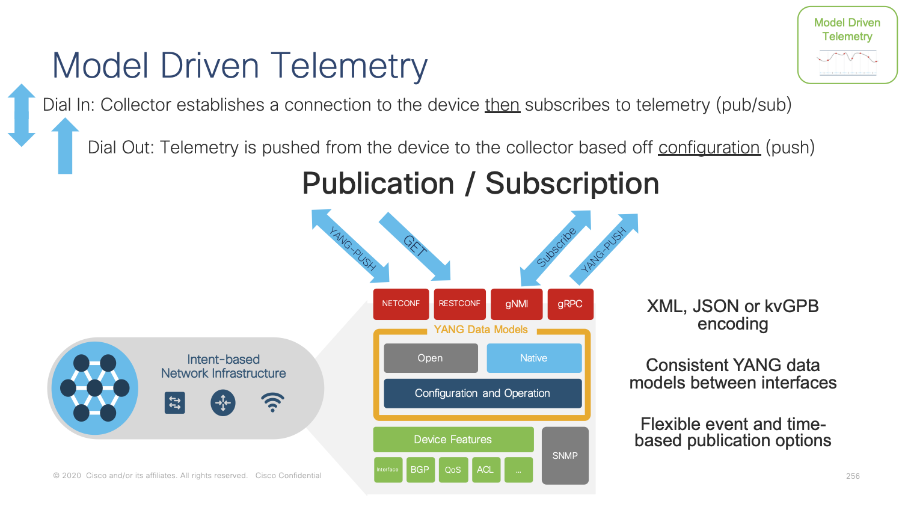
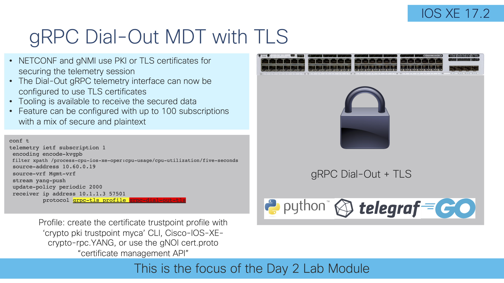
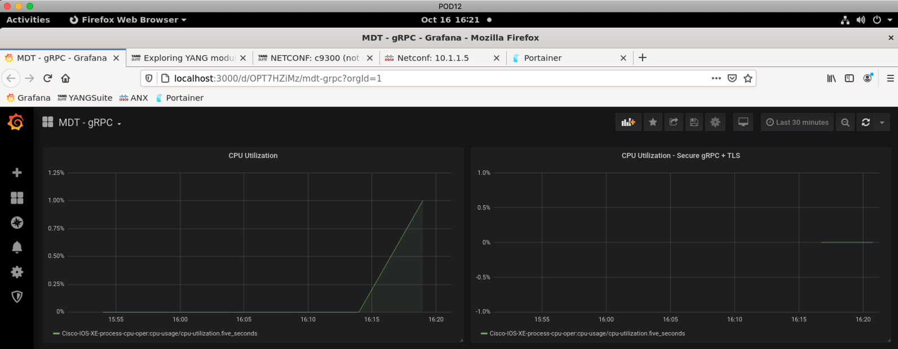
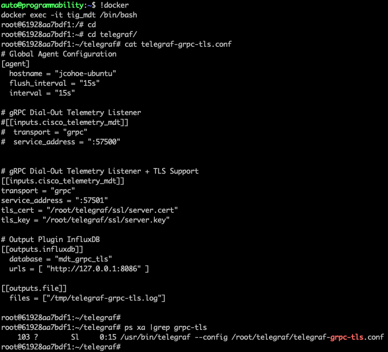

## [IOS XE Programmability Lab](https://github.com/jeremycohoe/cisco-ios-xe-programmability-lab)


## Module: Model Driven Telemetry

## Topics Covered


# Model-Driven Telemetry

Network data collection for today s high-density platforms and scale is becoming a tedious task for monitoring and troubleshooting. There is a need for operational data from different devices in the network to be collected in a centralized location, so that cross-functional groups can collaboratively work to analyze and fix an issue.

**Model-driven Telemetry** (MDT) provides a mechanism to stream data from an MDT-capable device to a destination. It uses a new approach for network monitoring in which data is streamed from network devices continuously using a push model and provides near real-time access to operational statistics for monitoring data. Applications can subscribe to specific data items they need, by using standards-based YANG data models over open protocols. Structured data is published at a defined cadence or on-change, based upon the subscription criteria and data type.

There are two main MDT Publication/Subscription models, Dial-in and Dial-out:

**Dial-in** is a dynamic model. An application based on this model has to open a session to the network device and send one or more subscriptions reusing the same session. The network device will send the publications to the application for as long as the session stays up. **NETCONF** and **gNMI** are the Dial-In telemetry interfaces. 

**Dial-out** is a configured model. The subscriptions need to be statically configured on the network device using any of the available interfaces (CLI, APIs, etc.) and the device will open a session with the application. If the session goes down, the device will try to open a new session. **gRPC** is the Dial-Out telemetry interface.



In this lab we cover the **gRPC Dial-out** telemetry that was released in IOS XE 16.10 along with the open source software stack for collection and visualization:

- **Telegraf (Collection)** with the **cisco\_telemetry\_mdt** plugin that decodes the gRPC data to text
- **InfluxDB (Storage)**: an open-source time series database optimized for fast, high-availability storage and retrieval of time series data in fields such as operations monitoring, application metrics, Internet of Things sensor data, and real-time analytics. It provides a SQL-like language with built-in time functions for querying a data structure composed of measurements, series, and points
- **Grafana (GUI visualization)**: an open-source platform to build monitoring and analytics dashboards

Every LAB POD includes a full installation of all the above-mentioned software. 

The focus of this lab is on gRPC with TLS security certificates: 




# gRPC + TLS

The gRPC MDT interface was introduced in IOS XE 16.10 and in 17.2 support for TLS security encapsulation was added. This means that the gRPC telemetry data can be sent in un-encrypted in plain text, or encrypted using TLS certificates as will be explored further below.

Before looking at the gRPC-TLS feature configuration, the required TLS certificates need to be installed into IOS XE. See the previous verious of the lab guide for those details, it's a manual process that is error prone. This time the certificates can be loaded using the **gNOI cert.proto certificate management API** as detailed in the DayN/gNOI/cert.proto module. Refer to that module for details of the gNOI cert.proto.

## Load the certificates from the Ubuntu into the C9300 with the gnoi_cert tooling

From the Ubuntu linux shell enter the **gnmi-ssl** directory and then go into the **certs** folder - these are the certs to load into the gNMI API via gNOI cert.proto's bootstrapping feature. If DayN/gNOI/cert.proto module was already completed then this step has already been completed.

**cd ~/gnmi_ssl/certs**

**/home/auto/gnoi_cert -target_addr c9300:9339 -op provision  -target_name c9300 -alsologtostderr -organization "jcohoe org" -ip_address 10.1.1.5 -time_out=10s -min_key_size=2048 -cert_id gnxi-cert -state BC -country CA -ca ./rootCA.pem  -key ./rootCA.key**

```
/home/auto/gnoi_cert -target_addr c9300:9339 -op provision  -target_name c9300 -alsologtostderr -organization "jcohoe org" -ip_address 10.1.1.5 -time_out=10s -min_key_size=2048 -cert_id gnxi-cert -state BC -country CA -ca ./rootCA.pem  -key ./rootCA.key
```

### Load the grpc-dial-out-tls TLS certificate with gNOI

Follow the similar proceedure as above to use the gnoi_cert tooling to install the **grpc-dial-out-tls** certificate into the IOS XE truststore.

**cd ~/gnmi_ssl/certs-grpc-tls**

**/home/auto/gnoi_cert -target_addr c9300:9339 -op provision  -target_name c9300 -alsologtostderr -organization "jcohoe org" -ip_address 10.1.1.5 -time_out=10s -min_key_size=2048 -cert_id grpc-dial-out-tls -state BC -country CA -ca ./myca.cert  -key ./myca.key**

```
cd ~/gnmi_ssl/certs-grpc-tls/
/home/auto/gnoi_cert -target_addr c9300:9339 -op provision  -target_name c9300 -alsologtostderr -organization "jcohoe org" -ip_address 10.1.1.5 -time_out=10s -min_key_size=2048 -cert_id grpc-dial-out-tls -state BC -country CA -ca ./myca.cert  -key ./myca.key
```

Use the **show crypto pki trustpoint | i Tr** CLI to see details of the newly installed certificates. The gnoi_cert "GET" operation can also be used to see the certificate details.

```
C9300#show crypto pki trustpoints | i Tr
Trustpoint CISCO_IDEVID_SUDI_LEGACY:
Trustpoint CISCO_IDEVID_SUDI_LEGACY0:
Trustpoint CISCO_IDEVID_SUDI:
Trustpoint CISCO_IDEVID_SUDI0:
Trustpoint SLA-TrustPoint:
Trustpoint TP-self-signed-107381648:
Trustpoint gnxi-cert:
Trustpoint grpc-dial-out-tls:
```

Continue to the next section to enable gRPC-TLS using this newly installed certificate.

## Configure gRPC-TLS

The main difference when creating a gRPC-TLS configuration is to specify the **grpc-tls profile** as part of the receiver IP address configuration, specifically:

receiver ip address 10.1.1.3 57500 **protocol grpc-tls profile grpc-dial-out-tls**

An completed exammple gRPC-TLS configuration is shown below

```
conf t
no telemetry ietf subscription 201
telemetry ietf subscription 201
encoding encode-kvgpb
filter xpath /process-cpu-ios-xe-oper:cpu-usage/cpu-utilization/five-seconds
source-address 10.1.1.5
stream yang-push
update-policy periodic 6000
receiver ip address 10.1.1.3 57501 protocol grpc-tls profile grpc-dial-out-tls
end
```

Copy and paste the gRPC-TLS configuration into the C9300:


### Verify 

The **show telemetry** CLI command can be used to see the **State** of the secure telemetry connection. It should be in the **Connected** state:

**show telemetry ietf subscription 201 receiver**

```
C9300#show telemetry ietf subscription 201 receiver
Telemetry subscription receivers detail:

  Subscription ID: 201
  Address: 10.1.1.3
  Port: 57501
  Protocol: grpc-tls
  Profile: grpc-dial-out-tls
  Connection: 25
  State: Connected
  Explanation:
```

Proceed to the Grafana GUI , where the telemetry data is visualized

## Visualize gRPC-TLS with Grafana

Open the Firefox browser and navigate to the Grafana tab or shortcut. 

The window on the **LEFT** indicates the non-secured telemetry connection, that has been sending data the whole time.

The window on the **RIGHT** indicates the secured telemetry connection, that has just come up as there is no historical mesurements for this counter.




## Explore telegraf-grpc-tls.conf

The telegraf configuration file that is receiving the telemetry data on port 57502 is within the **tig_mdt** Docker container at **/root/telegraf/**

The related TLS certifcates have been preinstalled into the Docker container's Telegraf configuration, located at **/root/telegraf/ssl** 

Explore the 



Additional gRPC and Model Driven Telemetry configuration examples can be found on the Github page at [https://github.com/jeremycohoe/cisco-ios-xe-mdt](https://github.com/jeremycohoe/cisco-ios-xe-mdt)

## Add Device Health Dashboard + grpc-tls configurations

Note; Add content from https://grafana.com/grafana/dashboards/13462 and adjust for TLS/IP's/etc


# Conclusion

This completes the gRPC-TLS section of the lab module. Refer to the previous lab guide, linked below, that covers gRPC telemetry in more detail, as well as Telegraf, InfluxDB, and Grafana - including the tig_mdt Docker container. This lab modules focus is on the gRPC-TLS telemetry connection, while the previous lab guide covers each of the Model Driven Telemetry (MDT) interfaces (NETCONF, gRPC, gNMI) in greater detail.

[https://github.com/jeremycohoe/cisco-ios-xe-programmability-lab-module-6-mdt/blob/master/README-172.md](https://github.com/jeremycohoe/cisco-ios-xe-programmability-lab-module-6-mdt/blob/master/README-172.md)	
