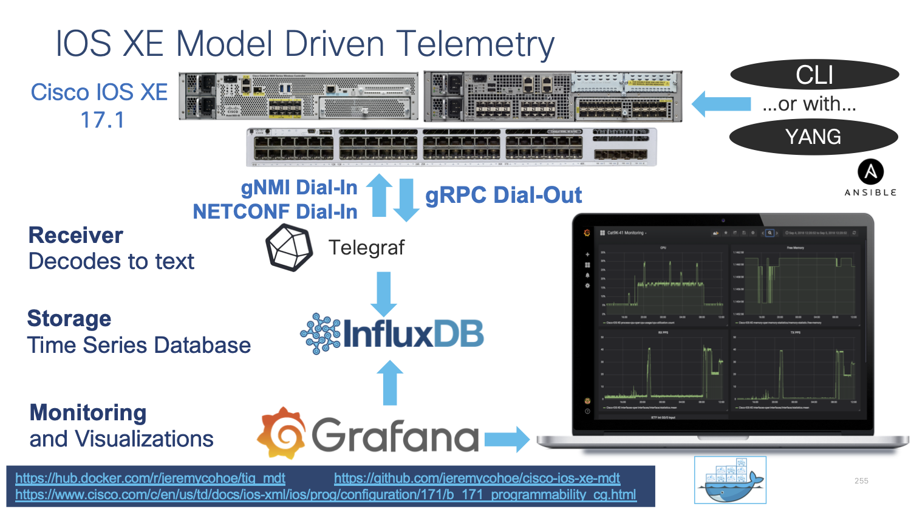

## [IOS XE Programmability Lab](https://github.com/jeremycohoe/cisco-ios-xe-programmability-lab)


## Module: Model Driven Telemetry

## Topics Covered:
Model-Driven Telemetry

Verify clock synchronization

Configured Subscriptions**

Explore Telegraf

Exploring InfluxdDB

Grafana Dashboard

Conclusion


# Model-Driven Telemetry

Network data collection for today s high-density platforms and scale is becoming a tedious task for monitoring and troubleshooting. There is a need for operational data from different devices in the network to be collected in a centralized location, so that cross-functional groups can collaboratively work to analyze and fix an issue.

**Model-driven Telemetry** (MDT) provides a mechanism to stream data from an MDT-capable device to a destination. It uses a new approach for network monitoring in which data is streamed from network devices continuously using a push model and provides near real-time access to operational statistics for monitoring data. Applications can subscribe to specific data items they need, by using standards-based YANG data models over open protocols. Structured data is published at a defined cadence or on-change, based upon the subscription criteria and data type.

 There are two main MDT Publication/Subscription models, Dial-in and Dial-out:

**Dial-in** is a dynamic model. An application based on this model has to open a session to the network device and send one or more subscriptions reusing the same session. The network device will send the publications to the application for as long as the session stays up.

**Dial-out** is a configured model **.** The subscriptions need to be statically configured on the network device using any of the available interfaces (CLI, APIs, etc.) and the device will open a session with the application. If the session goes down, the device will try to open a new session.


In this lab we cover the **gRPC Dial-out** telemetry that was released in IOS XE 16.10 along with the open source software stack for collection and visualization:

- **Telegraf (Collection)** with the **cisco\_telemetry\_mdt** plugin that decodes the gRPC data to text
- **InfluxDB (Storage)**: an open-source time series database optimized for fast, high-availability storage and retrieval of time series data in fields such as operations monitoring, application metrics, Internet of Things sensor data, and real-time analytics. It provides a SQL-like language with built-in time functions for querying a data structure composed of measurements, series, and points
- **Grafana (GUI visualization)**: an open-source platform to build monitoring and analytics dashboards

Every LAB POD includes a full installation of all the above-mentioned software.

**Verify clock synchronization (optional - only required if troubleshooting)**

When collecting data from any source, a key requirement is a precise and reliable time reference. If the data source and the collector clocks are not aligned, the data becomes inaccurate and can lead to misleading interpretations of a system state.

This lab relies on NTP (Network Time Protocol) to keep all the devices in sync with the Ubuntu Linux Server acting as NTP master. Ensure the NTP configuration is correct on the C9300 with the show clock command

1. From the Windows Jump Host desktop, connect to each of the IOS XE devices and check that the current time is correct and that the NTP server is configured.

```
c9300# show clock
	...
c9300# sh run | include ntp
ntp server 10.1.1.3


csr1000# show clock
	...
csr1000# sh run | include ntp
ntp server 10.1.1.3


C9800# show clock
	...
C9800# sh run | include ntp
ntp server 10.1.1.3
```

**Ensure that the time is in-sync between the IOS XE devices.**

1. On the Windows Jump Host desktop, double-click on the **Ubuntu** icon to open a PuTTY session. Check NTP status and verify NTP is syncronized


```

auto@automation:~$ date

Wed Oct 9 09:02:12 PDT 2029

If required, manually set the time:

$ sudo date +%Y%m%d -s "19990612"

$ sudo date +%T -s  "09:00:00"


```
Finally on the Windows Jump Host confirm the time is correct. In order to sync the time if it is not correct, right click on the time, select  "Adjust date\time", select the  "Internet Time" tab and then  "Change settings" then  "Update now"

You may need to click  "Update now" several times before the Windows host is able to successful synchronize with the NTP time source.

The time is in now sync across all hosts.


# **gRPC Dial-Out Configured Subscriptions**

Lets continue by checking the subscriptions configured on the Catalyst 9300.

1. On the Windows Jump Host desktop, double-click on the **Cat9300** icon to open a PuTTY session to the switch.

1. Check the subscription configured on the device using the following IOS XE CLI

**C9300# show run | sec telemetry**


Lets analyze the main parts of the subscription configuration:

- telemetry ietf subscription 101 (subscription ID)
- encoding encode-kvgpb (Key-Value pair encoding)
- filter xpath /process-cpu-ios-xe-oper:cpu-usage/cpu-utilization/five-seconds (xpath)
- update-policy periodic 500 (period in 1/100 seconds, 5 secs here)
- receiver ip address 10.1.1.3 57500 protocol grpc-tcp (receivers IP, port and protocol)

This telemetry configuration has already been applied to the switch. However, if it needs to be re-applied the following can be used to easily copy/paste:

```
conf t
telemetry ietf subscription 101
 encoding encode-kvgpb
 filter xpath /process-cpu-ios-xe-oper:cpu-usage/cpu-utilization/five-seconds
 source-address 10.1.1.5
 stream yang-push
 update-policy periodic 500
 receiver ip address 10.1.1.3 57500 protocol grpc-tcp

```

1. Verify the configured subscription using the following **telemetry** IOS XE CLIs

**c9300# sh telemetry ietf subscription all**

```

  Telemetry subscription brief

  ID               Type        State       Filter type
  -----------------------------------------------------
  101              Configured  Valid       xpath

```


**c9300# sh telemetry ietf subscription 101 detail**

```
Telemetry subscription detail:

  Subscription ID: 101
  Type: Configured
  State: Valid
  Stream: yang-push
  Filter:
    Filter type: xpath
    XPath: /process-cpu-ios-xe-oper:cpu-usage/cpu-utilization/five-seconds
  Update policy:
    Update Trigger: periodic
    Period: 500
  Encoding: encode-kvgpb
  Source VRF:
  Source Address: 10.1.1.5
  Notes:

  Receivers:
    Address          Port             Protocol         Protocol Profil
    ------------------------------------------------------------------
    10.1.1.3         57500            grpc-tcp

```

**c9300# sh telemetry ietf subscription 101 receiver**

```
Telemetry subscription receivers detail:

  Subscription ID: 101
  Address: 10.1.1.3
  Port: 57500
  Protocol: grpc-tcp
  Profile:
  State: Connected
  Explanation:
```


The State should report **Connected**.

If that state does not show Connected, for example, if it is the  "Connecting " state, then simple remove and re-add the telemetry configuration before continuing with the next steps and troubleshooting:

```
conf t
no telemetry ietf subscription 101
telemetry ietf subscription 101
 encoding encode-kvgpb
 filter xpath /process-cpu-ios-xe-oper:cpu-usage/cpu-utilization/five-seconds
 source-address 10.1.1.5
 stream yang-push
 update-policy periodic 500
 receiver ip address 10.1.1.3 57500 protocol grpc-tcp
```


Note: If the state does not show  "Connected " then ensure the Docker container with the Telegraf receiver is running correctly. Follow the next steps to confirm status of each component.

**Explore Telegraf, Influx, Grafana (TIG)**



Telegraf is the tool that receives and decodes the telemetry data that is sent from the IOS XE devices. It processes the data and sends it into the InfluxDB datastore, where Grafana can access it in order to create visualizations.

Telegraf runs inside the  "tig\_mdt " Docker container. To connect to this container from the Ubuntu host follow the steps below:

**auto@automation:~$ docker ps**


**auto@automation:~$ docker exec -it tig\_mdt /bin/bash**


Once inside the Docker container navigate to the telegraf directory and review the configuration file and log

**# cd /root/telegraf**

**# cat telegraf-grpc.conf**


This configuration file shows us the following:

**gRPC Dial-Out Telemetry Input:** This defines the telegraf plugin (cisco\_telemetry\_mdt) that is being used to receive the data, as well as the port (57500)

**Output Plugin:** This defines where the received data is sent to (outputs.influxdb) the database to use (telegraf) and the URL for InfluxDB ([http://127.0.0.1:8086](http://127.0.0.1:8086/))

**Outputs.file** : sends a copy of the data to the text file at /root/telegraf/telegraf.log

These configuration options are defined as per the README file in each of the respective input or output plugins. For more details of the cisco\_telemetry\_mdt plugin that is in use here, see the page at [https://github.com/influxdata/telegraf/tree/master/plugins/inputs/cisco\_telemetry\_mdt](https://github.com/influxdata/telegraf/tree/master/plugins/inputs/cisco_telemetry_mdt)

Examining the output of the telegraf.log file shows the data coming in from the IOS XE device that matches the subscription we created and do ctrl+c to stop the output

**# tail -F /tmp/telegraf.log**


**Exploring InfluxdDB**

InfluxDB is already installed and started within the same Docker container. Lets verify it s working correctly by connecting into the Docker contain where it is running.

1. Verify InfluxDB is running:

**ps xa | grep influx**

```
15 pts/0 Sl+ 1:45 /usr/bin/influxd -pidfile /var/run/influxdb/influxd.pid -config /etc/influxdb/influxdb.conf

```
1. Lets verify the data stored on the Influx database using the command shown below:

**influx**

```
root@43f8666d9ce0:~# influx
Connected to http://localhost:8086 version 1.7.7
InfluxDB shell version: 1.7.7
> show databases
name: databases
name
----
_internal
mdt_gnmi
mdt_grpc
cisco_mdt
mdt_netconf
>
> drop database cisco_mdt
> quit
root@43f8666d9ce0:~#
root@43f8666d9ce0:~#
root@43f8666d9ce0:~#
root@43f8666d9ce0:~#
root@43f8666d9ce0:~#
root@43f8666d9ce0:~#
root@43f8666d9ce0:~# influx
Connected to http://localhost:8086 version 1.7.7
InfluxDB shell version: 1.7.7
>
> show databases
name: databases
name
----
_internal
mdt_gnmi
mdt_grpc
mdt_netconf
>
> use mdt_grpc
Using database mdt_grpc
> show measurements
name: measurements
name
----
Cisco-IOS-XE-process-cpu-oper:cpu-usage/cpu-utilization
>
> SELECT COUNT("five_seconds") FROM "Cisco-IOS-XE-process-cpu-oper:cpu-usage/cpu-utilization"
name: Cisco-IOS-XE-process-cpu-oper:cpu-usage/cpu-utilization
time count
---- -----
0    1134
>
```

The output above shows:

- a **telegraf** dababase as defined in the Telegraf config file which holds that telemry data
- one measurement defined as the YANG model used for the gRPC Dial-out subscription (Cisco-IOS-XE-process-cpu-oper:cpu-usage/cpu-utilization)
- number of publications received so far (33251).


# **Grafana Dashboard**

Grafana is an open-source platform to build monitoring and analytics dashboards that also runs within the Docker container. Navigating to the web based user interface allows us to see the dashboard with the Model Driven Telemetry data

1. Verify Grafana is running:

**ps xa | grep grafana**

```
44 ? Sl 0:32 /usr/sbin/grafana-server --pidfile=/var/run/grafana-server.pid --config=/etc/grafana/grafana.ini --packaging=deb cfg:default.paths.provisioning=/etc/grafana/provisioning cfg:default.paths.data=/var/lib/grafana cfg:default.paths.logs=/var/log/grafan cfg:default.paths.plugins=/var/lib/grafana/plugins**
```


1. Open Firefox or Chrome and access the interface Grafana at [http://10.1.1.3:3000](http://10.1.1.3:3000/)

 You should see the following dashboard after logging in with admin:Cisco123


To better understand the Grafana dashboard, lets edit the dashlet to see which data is being displayed:

1. Access the Grafan UI on HTT port 3000
2. Click the ** "CPU Utilization – 5 Second "** drop-down and then select ** "Edit "**


1. Review the information this is pre-configured for this particular chart:


# **Conclusion**

This module has shown how to configure the gRPC Dial Out configured telemetry feature on IOS XE. Using the Docker container with the open-source Telegraf + InfluxDB + Grafana stack you were able to receive, store, and visualize the telemetry information.
